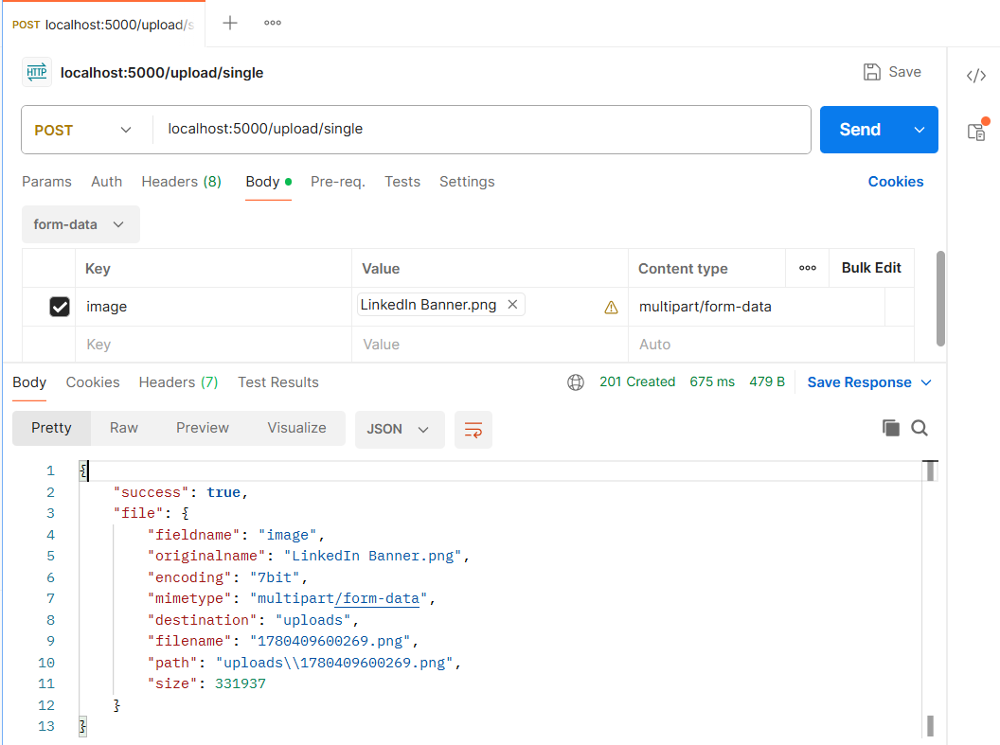
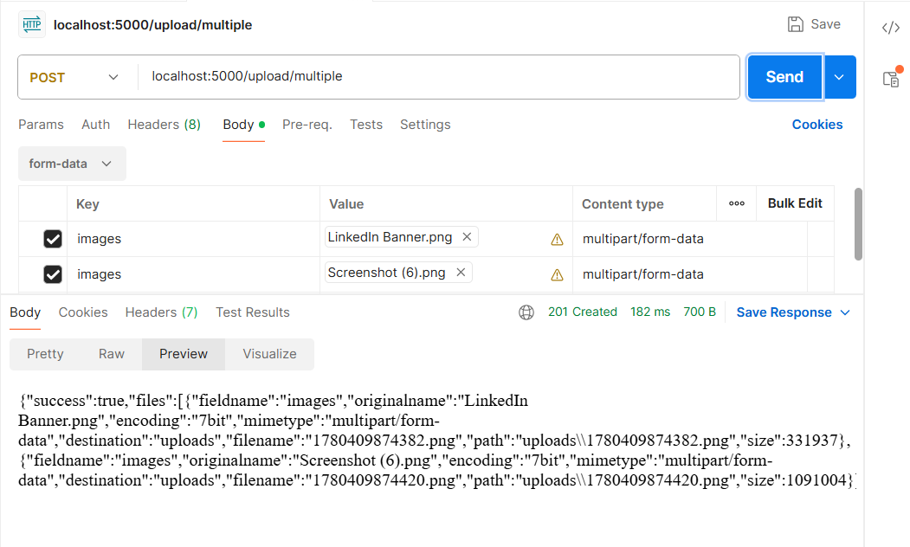
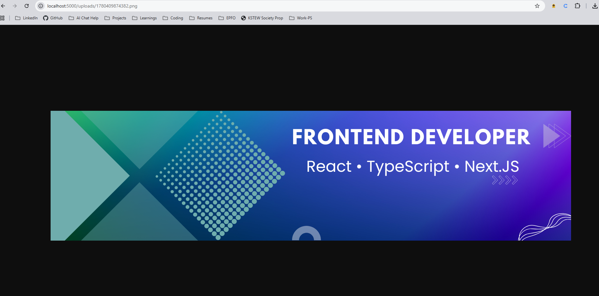

# File Uploads with Node.js, Express & Multer

Learn how to build a production-style file upload API using **Node.js**, **Express.js**, and **Multer**.

This project covers:

- Upload Single Image
- Upload Multiple Images
- File Type Validation
- File Size Validation
- Local File Storage
- Serving Uploaded Files

---

## Features

### Single File Upload

Upload a single image file.

```http
POST /upload/single
```

---

### Multiple File Upload

Upload multiple image files at once.

```http
POST /upload/multiple
```

---

### Local File Storage

Uploaded files are stored inside the project.

```text
uploads/
├── image1.jpg
├── image2.png
└── image3.webp
```

---

### View Uploaded Files

Uploaded files can be accessed directly through the browser.

Example:

```http
http://localhost:3000/uploads/filename.jpg
```

---

## Project Structure

```text
project-root
│
├── uploads/
│   ├── image1.jpg
│   ├── image2.png
│   └── image3.webp
│
├── src/
│   ├── controllers/
│   ├── routes/
│   ├── middleware/
│   └── app.js
│
├── package.json
└── node_modules/
```

---

## Required Package

Install Multer:

```bash
npm install multer
```

---

## How File Upload Works

```text
Client
   ↓
Select File
   ↓
Send Multipart/Form-Data Request
   ↓
Express Route
   ↓
Multer Middleware
   ↓
Validate File
   ↓
Store File
   ↓
Return Response
```

---

## API Endpoints

| Method | Endpoint             | Description            |
| ------ | -------------------- | ---------------------- |
| POST   | `/upload/single`     | Upload Single Image    |
| POST   | `/upload/multiple`   | Upload Multiple Images |
| GET    | `/uploads/:filename` | View Uploaded File     |

---

## Upload Single Image

### Endpoint

```http
POST /upload/single
```



### Success Response

```json
{
  "success": true,
  "file": {
    "fieldname": "image",
    "originalname": "LinkedIn Banner.png",
    "encoding": "7bit",
    "mimetype": "multipart/form-data",
    "destination": "uploads",
    "filename": "1780409600269.png",
    "path": "uploads\\1780409600269.png",
    "size": 331937
  }
}
```

---

## Upload Multiple Images

### Endpoint

```http
POST /upload/multiple
```



### Success Response

```json
{
  "success": true,
  "files": [
    {
      "fieldname": "images",
      "originalname": "LinkedIn Banner.png",
      "encoding": "7bit",
      "mimetype": "multipart/form-data",
      "destination": "uploads",
      "filename": "1780409874382.png",
      "path": "uploads\\1780409874382.png",
      "size": 331937
    },
    {
      "fieldname": "images",
      "originalname": "Screenshot (6).png",
      "encoding": "7bit",
      "mimetype": "multipart/form-data",
      "destination": "uploads",
      "filename": "1780409874420.png",
      "path": "uploads\\1780409874420.png",
      "size": 1091004
    }
  ]
}
```

---

## Access Uploaded Files

After uploading, files can be viewed directly:

```http
http://localhost:3000/uploads/filename.jpg
```

Example:

```http
http://localhost:3000/uploads/profile.jpg
```

## 

## Request Flow

```text
Client Request
      ↓
Express Route
      ↓
Multer Middleware
      ↓
File Validation
      ↓
Store File
      ↓
Response
```
